<picture>
  <source media="(prefers-color-scheme: dark)" srcset="./dark.svg">
  <source media="(prefers-color-scheme: light)" srcset="./light.svg">
  
</picture>

<h3 align="center">Software-first Engineer · Full-Stack Developer · Digital Design (Verilog/VHDL) on the side</h3>

B.Tech Electronics and Communication Engineering student at Presidency University, Bengaluru — building full-stack web applications and picking up RTL/Verilog design along the way.

---

## Focus

- Full-stack web development — React, Next.js
- Backend & applied programming — Java, Python
- Digital design / RTL — Verilog, VHDL (side interest)

## Education

**B.Tech, Electronics and Communication Engineering** — Presidency University, Bengaluru

## Featured Projects

**[Forage Midas](https://github.com/vagabond-systems/forage-midas)**
Spring Boot job-simulation task — Kafka, H2, Testcontainers

**Advanced Pothole Detection & Mitigation**
Capstone project — computer vision + embedded detection system

**Verilog HDL Series**
4-project RTL series — logic gates, ripple carry adder, flip-flop/counter, FSM

## Engineering Stack

**Languages** — C · C++ · Java · Python · JavaScript · TypeScript
**Frontend** — HTML5 · CSS3 · React · Next.js
**Backend / Tools** — Node.js · NPM · MySQL · .NET
**Data / ML** — NumPy · Pandas · Matplotlib · SciPy · TensorFlow · PyTorch
**Platforms** — Vercel · Netlify · Windows Terminal · PowerShell

## GitHub Activity

## Connect

  
